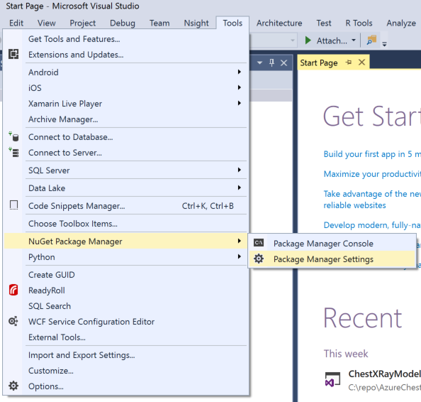
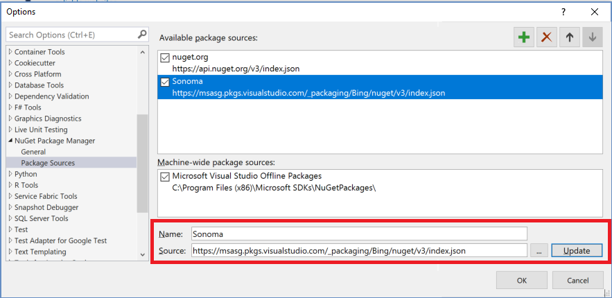

# Visual Studio Tools for AI

**NOTE:** This is currently available externally and may be used in customer engagements and/or production use cases yet. However, it does not yet use the One RP model and will need to be updated soon to leverage these changes in Azure ML. 

## Existing features
Visual Studio Tools for AI is an extension to build, test, and deploy Deep Learning / AI solutions. It seamlessly integrates with Azure Machine Learning for robust experimentation capabilities, including but not limited to submitting data preparation and model training jobs transparently to different compute targets. Additionally, it provides support for custom metrics and run history tracking, enabling data science reproducibility and auditing. Enterprise ready collaboration, allow to securely work on project with other people.

 - Develop, debug and deploy deep learning models and AI solutions
	 - Use the productivity features of Visual Studio to accelerate AI innovation today. Use built-in code editor features like syntax highlighting, IntelliSense and text auto formatting. You can interactively test your deep learning application in your local environment using step-through debugging on local variables and models.
 - Scale out deep learning model training and/or inferencing to the cloud
	 - This extension makes it easy to train models on your local computer or you can submit jobs to the cloud by using our integration with Azure Machine Learning. You can submit jobs to different compute targets like Spark clusters, Azure GPU virtual machines and more
 - Get started quickly with the Azure Machine Learning Sample Gallery
	 - Visual Studio Tools for AI is integrated with Azure Machine Learning to make it easy to browse through a gallery of sample experiments using CNTK, TensorFlow, MMLSpark and more.
 
Learn more (including tutorials) at [Visual Studio Tools for AI](https://github.com/Microsoft/vs-tools-for-ai/)

## New features

- Infuse AI models into apps with Microsoft Machine Learning Scoring (aka Sonoma) 
  - Once training is complete, building intelligent applications in Visual Studio is as easy as putting your trained model in your app just like any other library or resource.
  - VS Tools for AI makes this easy by enabling you to create a Model Inference Library project which automatically optimizes your ONNX/TensorFlow model for serving, as well as placing on optimized ONNX/TensorFlow runtime in the project.
  - Moreover, VS Tools for AI generates a C# stub class to simplify interaction with models in your app.
  - These Model Inference Library projects can be further deployed as NuGet packages for convenient distribution
- Infuse your apps, websites and bots with [Microsoft Cognitive Services](https://azure.microsoft.com/en-us/services/cognitive-services/) to see, hear, speak, understand and interpret your user needs through natural methods of communication.
  - Add Cognitive Services via GUI wizard and manage them in Visual Studio.
  - Build Cognitive Service apps from pre-defined templates.
  - Train and manage your own [Custom Vision](https://www.customvision.ai/) model from the generated training project or web portal.
- Interoperate between different AI frameworks through model file conversion.
  - Convert Core ML, TensorFlow, scikit-learn, XGBoost and LIBSVM models to [ONNX](https://onnx.ai/) format.
  - Integration with WinMLTools, ONNXMLTools and tf2onnx converters.
  - View network architecture and parameters of AI models in your training and inference projects. Please install the latest version of [Netron](https://github.com/lutzroeder/Netron/releases).
- Run remote machine jobs in Docker.
- Log in automatically to your password-based remote machines (e.g. Azure DSVM/DLVM). Please install the latest version of [Putty](https://www.chiark.greenend.org.uk/~sgtatham/putty/latest.html), and set the directory of “putty.exe” to %Path% environment variable.

- Bug fixes and stability improvements.

## Known issues
- Microsoft Machine Learning Scoring is in release process. Users need to add an internal NuGet package source manually to test model inference feature.
- Model converters depend on ONNX 1.1.1 Windows wheel package which is not officially released to PyPI yet. Currently, we host a pre-release build as a workaround.
- MXNet and Caffe2 do not have CUDA 9.0 Windows wheel package yet.

## Prerequisites
### 1. Install Python 3.5 or 3.6 
Install the latest [Python 3.5](https://www.python.org/downloads/release/python-354/) and add it to %Path% environment variable. Python 3.6 should work too.

### 2. Upgrade Visual Studio (optional) 
If you are Visual Studio 2017 users, please upgrade to 15.6.6 or above.

### 3. Upgrade NVidia GPU drivers (optional)  
If you are going to use a deep learning framework like Tensorflow or CNTK and have an NVidia GPU card, you should upgrade to the latest driver for the best performance and framework compatibility. You should also install [CUDA 9.0](https://developer.nvidia.com/cuda-90-download-archive) and [cuDNN 7.0](https://developer.nvidia.com/cudnn). 

### 4. Prepare local dev machine (optional)
Install the latest deep learning frameworks like TensorFlow, Keras, CNTK, ONNX and more as well using our automated installer.Run the following commands in a terminal window to setup your local environment. 

**NOTE:** If your Python distribution is installed in the system directory (e.g. the one shipped with Visual Studio 2017), administrative permission is required.

```
git clone https://github.com/Microsoft/samples-for-ai.git
cd samples-for-ai
git checkout installer-dev
python.exe install.py
pip install \\grgsi-91\Share\OpenMindStudio\BugBash\vs\2018-04\Assets\onnx-1.1.0-cp35-cp35m-win_amd64.whl 
**NOTE:** Use onnx-1.1.1-cp36-cp36m-win_amd64.whl if you install Python 3.6
```
 
## Installation

### 1. Install latest internal package of VS Tools for AI
Double-click the appropriate Visual Studio installer (vsix file) from the [daily build drop share](\\grgsi-91\Share\OpenMindStudio\BugBash\vs\2018-04\Internal\latest)   


### 2. Add Microsoft.MachineLearning.Scoring (Sonoma) Nuget reference 
To generate C# code from trained TensorFlow and ONNX models via  new Inferencing Library projects, you need to add a NuGet reference to the current private location in the [Bing NuGet feed](https://msasg.pkgs.visualstudio.com/_packaging/Bing/nuget/v3/index.json). 

To do this, add a NuGet package source in Visual Studio. From menu "Tools" => "NuGet Package Manager" => "Package Manager Settings" then add a new Package Source [https://msasg.pkgs.visualstudio.com/_packaging/Bing/nuget/v3/index.json](https://msasg.pkgs.visualstudio.com/_packaging/Bing/nuget/v3/index.json)

- Package Manager Settings

	

- Package Manager Source
	
	

## Try it out!
Some models are put in \\grgsi-91\Share\OpenMindStudio\BugBash\vs\2018-04\Assets to test model converter and visualization features.

## Bugs, feedback, issues, suggestions
Please log bugs at 
- Visual Studio Tools for AI: https://aka.ms/openmindstudio/bugbash
- Visual Studio Code Tools for AI: https://aka.ms/openmindstudio/bugbash/vscode

Please email [OpenMind Studio Team](omsdev@microsoft.com) with any questions or feedback!

