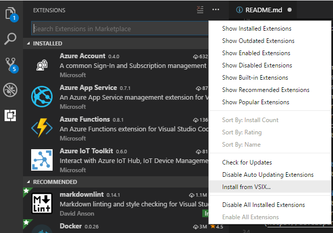

# Visual Studio Code Tools for AI

**NOTE:** This is currently available externally and may be used in customer engagements and/or production use cases yet. However, it does not yet use the One RP model and will need to be updated soon to leverage these changes in Azure ML. 

## Existing features
Visual Studio Code Tools for AI is an extension to build, test, and deploy Deep Learning / AI solutions. It seamlessly integrates with Azure Machine Learning for robust experimentation capabilities, including but not limited to submitting data preparation and model training jobs transparently to different compute targets. Additionally, it provides support for custom metrics and run history tracking, enabling data science reproducibility and auditing. Enterprise ready collaboration, allow to securely work on project with other people.

 - Develop, debug and deploy deep learning models and AI solutions
	 - Use the productivity features of Visual Studio Code to accelerate AI innovation today. Use built-in code editor features like syntax highlighting, IntelliSense and text auto formatting. You can interactively test your deep learning application in your local environment using step-through debugging on local variables and models.
 - Scale out deep learning model training and/or inferencing to the cloud
	 - This extension makes it easy to train models on your local computer or you can submit jobs to the cloud by using our integration with Azure Machine Learning. You can submit jobs to different compute targets like Spark clusters, Azure GPU virtual machines and more
 - Get started quickly with the Azure Machine Learning Sample Gallery
	 - Visual Studio Code Tools for AI is integrated with Azure Machine Learning to make it easy to browse through a gallery of sample experiments using TensorFlow, CNTK, MMLSpark and more.
 
Learn more (including tutorials) at [Visual Studio Code Tools for AI](https://github.com/Microsoft/vscode-tools-for-ai/)

## New features

- Improved experimentation job management experience 
  - Preview job assets such as stderr, stdout, or model files in standard VS Code editor windows.
  - After a job asset is downloaded, kindly notify users to open it in VS Code or reveal in OS file explorer.
  - For a remote machine job, list its assets in job detail page, and add an "Open Storage Explorer" button to visit the job directory.	
- Storage Explorer uses VS Code built-in icons for files and folders.
- Use notification dialog Improve configuration (in JSON) editing experience.
- Print detailed operation logs in the output window	
- Bug fixes and stability improvements.

## Prerequisites
### 1. Install Python 3.5 or 3.6 
Install the latest [Python 3.5](https://www.python.org/downloads/release/python-354/) and add it to %Path% environment variable. Python 3.6 should work too.

### 2. Upgrade NVidia GPU drivers (optional)  
If you are going to use a deep learning framework like Tensorflow or CNTK and have an NVidia GPU card, you should upgrade to the latest driver for the best performance and framework compatibility. You should also install [CUDA 9.0](https://developer.nvidia.com/cuda-90-download-archive) and [cuDNN 7.0](https://developer.nvidia.com/cudnn). 

### 3. Prepare local dev machine (optional)
Install the latest deep learning frameworks like TensorFlow, Keras, CNTK, ONNX and more as well using our automated installer.Run the following commands in a terminal window to setup your local environment. 

**NOTE:** If your Python distribution is installed in the system directory (e.g. the one shipped with Visual Studio 2017), administrative permission is required.

```
git clone https://github.com/Microsoft/samples-for-ai.git
cd samples-for-ai
git checkout installer-dev
python.exe install.py
pip install \\grgsi-91\Share\OpenMindStudio\BugBash\vs\2018-04\Assets\onnx-1.1.0-cp35-cp35m-win_amd64.whl 
**NOTE:** Use onnx-1.1.1-cp36-cp36m-win_amd64.whl if you install Python 3.6
```
 
## Installation

### 1. Install latest internal package of VS Code Tools for AI
You can manually install a VS Code extension packaged in a .vsix file. 
- Using the Install from VSIX... command in the Extensions View command drop-down, or
- Extensions: Install from VSIX... command in the Command Palette, point to the .vsix file.

Use the latest vsix file at \\grgsi-91\Share\OpenMindStudio\BugBash\vscode\2018-04\latest 



## Try it out!
Some models are put in \\grgsi-91\Share\OpenMindStudio\BugBash\vs\2018-04\Assets to test model converter and visualization features.

## Bugs, feedback, issues, suggestions
Please log bugs at 
- Visual Studio Tools for AI: https://aka.ms/openmindstudio/bugbash
- Visual Studio Code Tools for AI: https://aka.ms/openmindstudio/bugbash/vscode

Please email [OpenMind Studio Team](omsdev@microsoft.com) with any questions or feedback!

